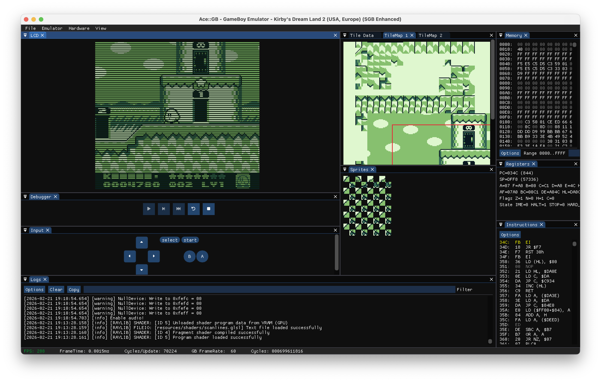
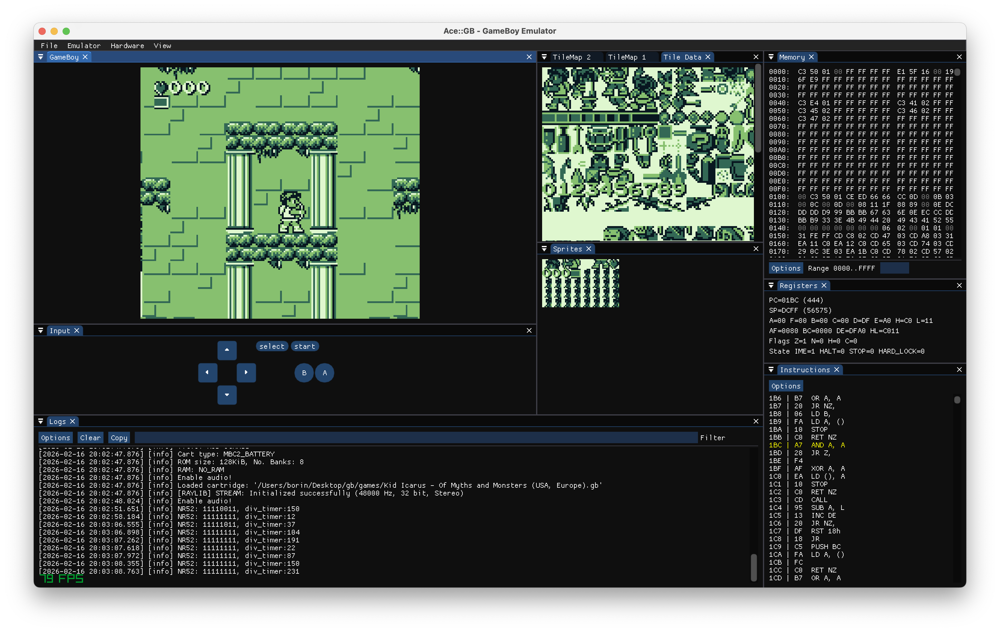
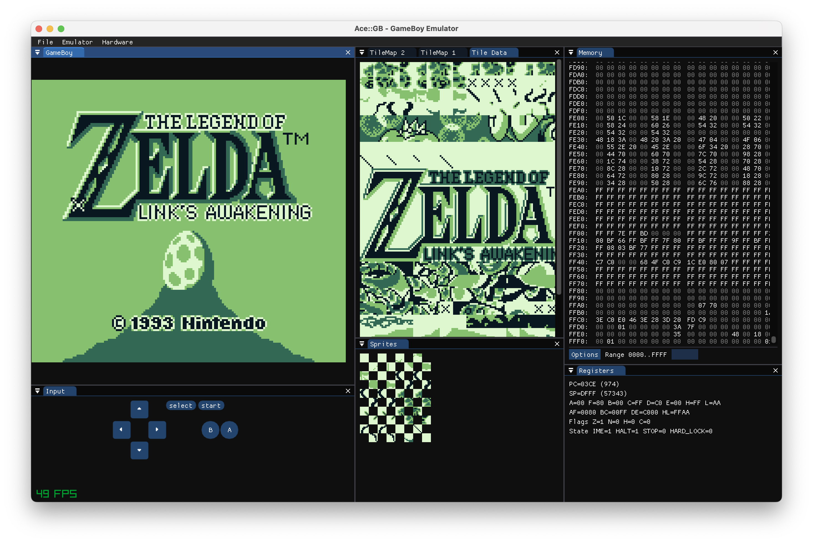
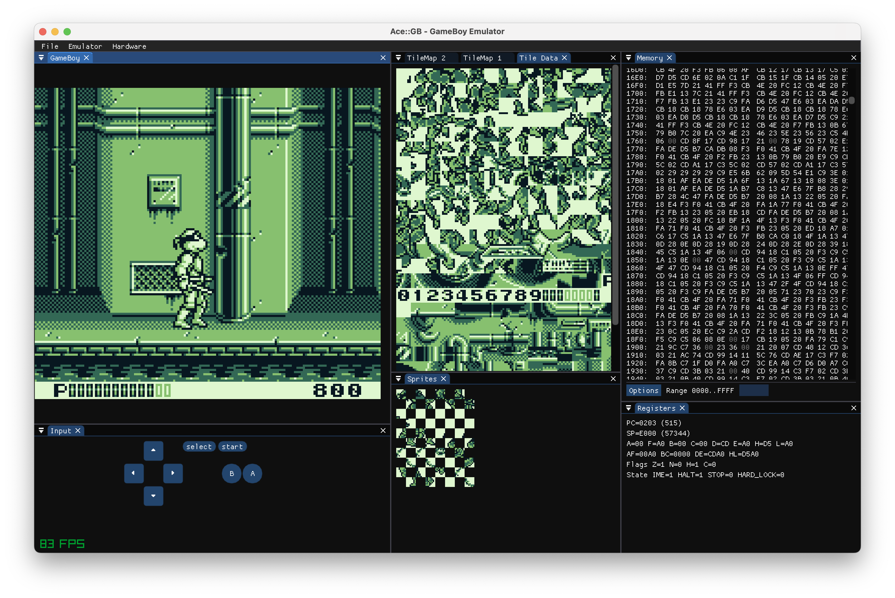
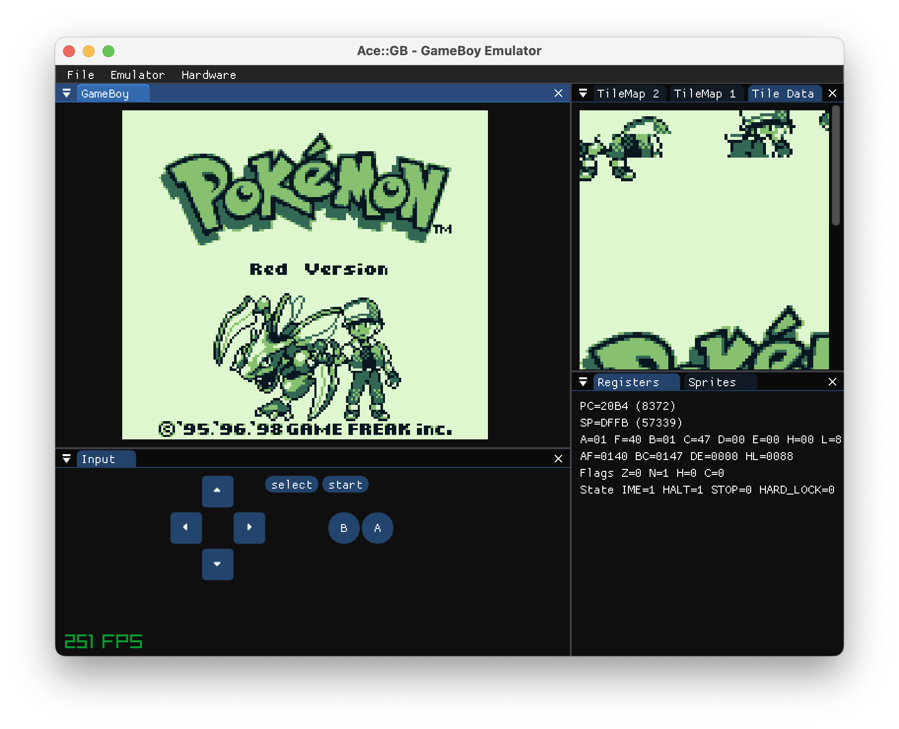

# Ace-GB Emulator

My first GameBoy emulator!!


## Screenshots









## Requirements

- [cmake](https://cmake.org)
- [vcpkg](https://github.com/microsoft/vcpkg)


## Build

```
git clone --recurse-submodules https://github.com/aceiii/ace-gb.git
cd ace-gb
cmake --preset Release
cmake --build --preset Release
```

## Run

```
./build-release/ace-gb
```

## Tests

### Mooneye Test Suite

#### Acceptance

- [x] bits/mem_oam.gb
- [x] bits/reg_f.gb
- [x] bits/unused_hwio-GS.gb
- [x] instr/daa.gb
- [ ] interrupts/ie_push.gb
- [x] oam_dma/basic.gb
- [x] oam_dma/reg_read.gb
- [x] oam_dma/sources-GS.gb
- [ ] ppu/hblank_ly_scx_timing-GS.gb
- [ ] ppu/intr_1_2_timing-GS.gb
- [ ] ppu/intr_2_0_timing.gb
- [ ] ppu/intr_2_mode0_timing_sprites.gb
- [ ] ppu/intr_2_mode0_timing.gb
- [ ] ppu/intr_2_mode3_timing.gb
- [ ] ppu/intr_2_oam_ok_timing.gb
- [ ] ppu/lcdon_timing-GS.gb
- [ ] ppu/lcdon_write_timing-GS.gb
- [ ] ppu/stat_irq_blocking.gb
- [ ] ppu/stat_lyc_onoff.gb
- [ ] ppu/vblank_stat_intr-GS.gb
- [ ] serial/boot_sclk_align-dmgABCmgb.gb
- [ ] timer/div_write.gb
- [ ] timer/rapid_toggle.gb
- [x] timer/tim00_div_trigger.gb
- [ ] timer/tim00.gb
- [ ] timer/tim01_div_trigger.gb
- [x] timer/tim01.gb
- [ ] timer/tim10_div_trigger.gb
- [ ] timer/tim10.gb
- [x] timer/tim11_div_trigger.gb
- [ ] timer/tim11.gb
- [ ] timer/tima_reload.gb
- [ ] timer/tima_write_reloading.gb
- [ ] timer/tma_write_reloading.gb
- [ ] add_sp_e_timing.gb
- [ ] boot_div-dmg0.gb
- [ ] boot_div-dmgABCmgb.gb
- [ ] boot_div-S.gb
- [ ] boot_div2-S.gb
- [ ] boot_hwio-dmg0.gb
- [ ] boot_hwio-dmgABCmgb.gb
- [ ] boot_hwio-S.gb
- [ ] boot_regs-dmg0.gb
- [x] boot_regs-dmgABC.gb
- [ ] boot_regs-mgb.gb
- [ ] boot_regs-sgb.gb
- [ ] boot_regs-sgb2.gb
- [ ] call_cc_timing.gb
- [ ] call_cc_timing2.gb
- [ ] call_timing.gb
- [ ] call_timing2.gb
- [ ] di_timing-GS.gb
- [x] div_timing.gb
- [ ] ei_sequence.gb
- [ ] ei_timing.gb
- [x] halt_ime0_ei.gb
- [ ] halt_ime0_nointr_timing.gb
- [x] halt_ime1_timing.gb
- [ ] halt_ime1_timing2-GS.gb
- [x] if_ie_registers.gb
- [x] intr_timing.gb
- [ ] jp_cc_timing.gb
- [ ] jp_timing.gb
- [ ] ld_hl_sp_e_timing.gb
- [ ] oam_dma_restart.gb
- [ ] oam_dma_start.gb
- [ ] oam_dma_timing.gb
- [x] pop_timing.gb
- [ ] push_timing.gb
- [ ] rapid_di_ei.gb
- [ ] ret_cc_timing.gb
- [ ] ret_timing.gb
- [ ] reti_intr_timing.gb
- [ ] reti_timing.gb
- [ ] rst_timing.gb

#### Emulator only

- [x] mbc1/bits_bank1.gb
- [x] mbc1/bits_bank2.gb
- [x] mbc1/bits_mode.gb
- [x] mbc1/bits_ramg.gb
- [x] mbc1/ram_64kb.gb
- [x] mbc1/ram_256kb.gb
- [x] mbc1/rom_512kb.gb
- [x] mbc1/rom_1Mb.gb
- [x] mbc1/rom_2Mb.gb
- [x] mbc1/rom_4Mb.gb
- [x] mbc1/rom_8Mb.gb
- [x] mbc1/rom_16Mb.gb
- [x] mbc1/multicart_rom_8Mb.gb
- [x] mbc2/bits_ramg.gb
- [x] mbc2/bits_romb.gb
- [x] mbc2/bits_unused.gb
- [x] mbc2/ram.gb
- [x] mbc2/rom_1Mb.gb
- [x] mbc2/rom_2Mb.gb
- [x] mbc2/rom_512kb.gb
- [x] mbc5/rom_16Mb.gb
- [x] mbc5/rom_1Mb.gb
- [x] mbc5/rom_2Mb.gb
- [x] mbc5/rom_32Mb.gb
- [x] mbc5/rom_4Mb.gb
- [x] mbc5/rom_512kb.gb
- [x] mbc5/rom_64Mb.gb
- [x] mbc5/rom_8Mb.gb

#### Madness

- [ ] mgb_oam_dma_halt_sprites.gb

#### Manual only

- [x] sprite_priority.gb

#### Misc

- [x] bits/unused_hwio-C.gb
- [ ] boot_div-A.gb
- [ ] boot_div-cgb0.gb
- [ ] boot_div-cgbABCDE.gb
- [ ] boot_hwio-C.gb
- [ ] boot_regs-A.gb
- [ ] boot_regs-cgb.gb
- [ ] ppu/vblank_stat_intr-C.gb


### Blargg Test ROMs

#### cgb_sound

- [x] 01-registers.gb
- [ ] 02-len ctr.gb
- [ ] 03-trigger.gb
- [ ] 04-sweep.gb
- [ ] 05-sweep details.gb
- [x] 06-overflow on trigger.gb
- [ ] 07-len sweep period sync.gb
- [ ] 08-len ctr during power.gb
- [ ] 09-wave read while on.gb
- [x] 10-wave trigger while on.gb
- [ ] 11-regs after power.gb
- [ ] 12-wave.gb

#### cpu_instrs

- [x] 01-special.gb
- [x] 02-interrupts.gb
- [x] 03-op sp,hl.gb
- [x] 04-op r,imm.gb
- [x] 05-op rp.gb
- [x] 06-ld r,r.gb
- [x] 07-jr,jp,call,ret,rst.gb
- [x] 08-misc instrs.gb
- [x] 09-op r,r.gb
- [x] 10-bit ops.gb
- [x] 11-op a,(hl).gb

#### dmg_sound

- [x] 01-registers.gb
- [x] 02-len ctr.gb
- [ ] 03-trigger.gb
- [x] 04-sweep.gb
- [x] 05-sweep details.gb
- [x] 06-overflow on trigger.gb
- [ ] 07-len sweep period sync.gb
- [ ] 08-len ctr during power.gb
- [ ] 09-wave read while on.gb
- [ ] 10-wave trigger while on.gb
- [x] 11-regs after power.gb
- [ ] 12-wave write while on.gb

#### instr_timing

- [x] instr_timing.gb

#### interrupt_time

- [ ] interrupt_time.gb

#### mem_timing

- [x] 01-read_timing.gb
- [x] 02-write_timing.gb
- [x] 03-modify_timing.gb

#### mem_timing-2

- [x] 01-read_timing.gb
- [x] 02-write_timing.gb
- [x] 03-modify_timing.gb

#### oam_bug

- [ ] 1-lcd_sync.gb
- [ ] 2-causes.gb
- [x] 3-non_causes.gb
- [ ] 4-scanline_timing.gb
- [ ] 5-timing_bug.gb
- [x] 6-timing_no_bug.gb
- [ ] 7-timing_effect.gb
- [ ] 8-instr_effect.gb


### DMG Acid2

- [x] dmg-acid2
